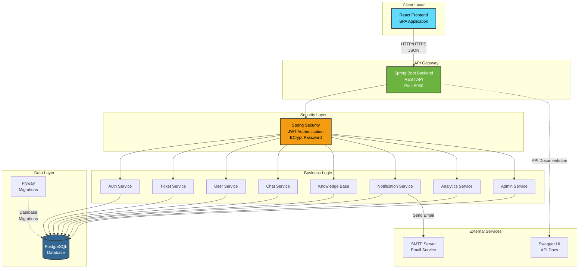
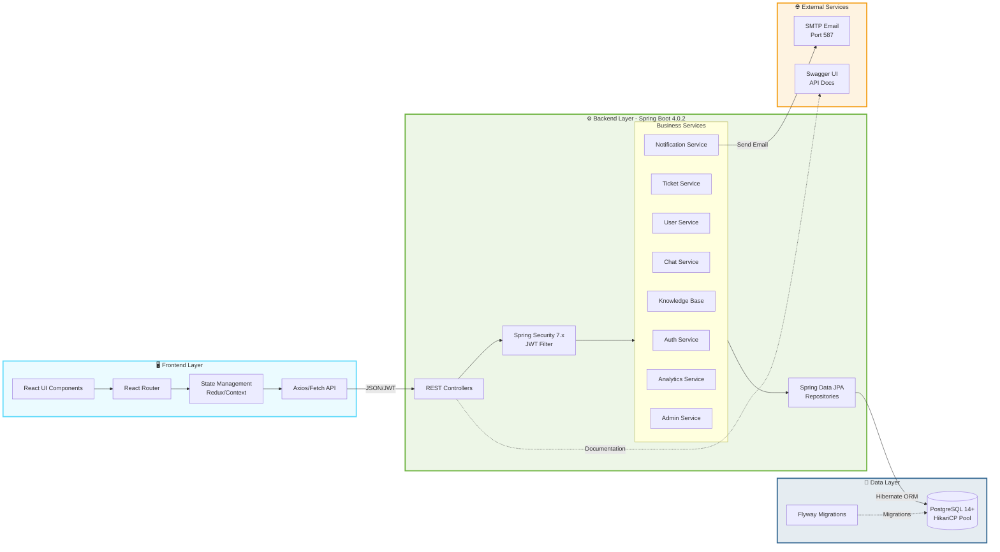
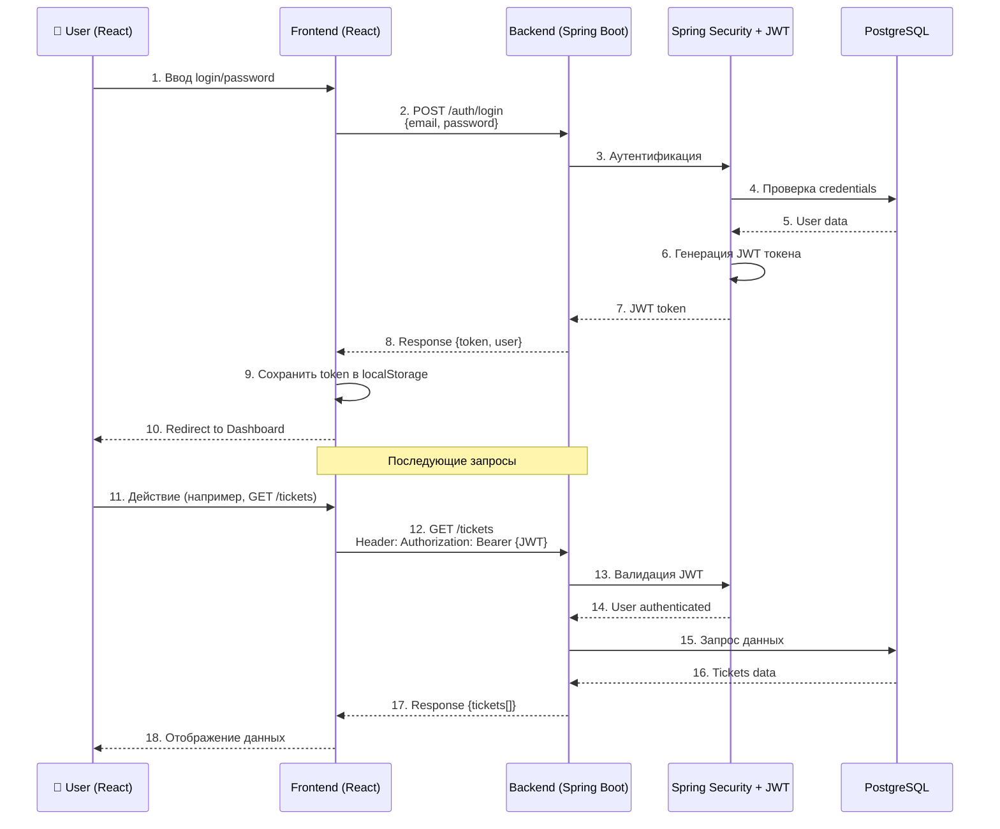

# 🎫 Support Portal

> Enterprise-grade Support Ticket Management System built with Spring Boot

[]()
[]()
[]()
[]()

## 📋 Описание

Support Portal - это современная система управления тикетами поддержки с полным функционалом:
- 🔐 JWT аутентификация и авторизация
- 🎫 Управление тикетами
- 💬 Чат система
- 📚 База знаний
- 🔔 Система уведомлений
- 👥 Управление пользователями и группами

## ✨ Что нового (версия 1.0.0)

### 🔥 Критические исправления
- ✅ Исправлены 8 критических ошибок безопасности
- ✅ Улучшена обработка JWT токенов
- ✅ Исправлена работа с authorities в Spring Security
- ✅ Добавлена проверка активности пользователей

### 🎯 Новые возможности
- ✅ Swagger UI документация API
- ✅ Автоматический аудит изменений
- ✅ Кастомная валидация паролей
- ✅ Generic API response обертки
- ✅ Улучшенное логирование

### 📦 Обновления зависимостей
- JWT: 0.11.5 → 0.12.5
- Lombok: 1.18.28 → 1.18.36
- Spring Boot: 4.0.2

## 🚀 Быстрый старт

### Требования
- Java 17+
- PostgreSQL 14+
- Maven 3.8+

### Установка

1. **Клонируйте репозиторий**
```bash
git clone <repository-url>
cd SupportPortal
```

2. **Настройте базу данных**
```sql
CREATE DATABASE supportdb;
CREATE USER ostafon WITH PASSWORD '0000';
GRANT ALL PRIVILEGES ON DATABASE supportdb TO ostafon;
```

3. **Установите переменные окружения**

Windows (PowerShell):
```powershell
```

4. **Запустите приложение**
```bash
mvn spring-boot:run
```

5. **Откройте Swagger UI**
```
http://localhost:8080/swagger-ui.html
```

## 📚 Документация

- [QUICKSTART.md](QUICKSTART.md) - Быстрый старт
- [IMPROVEMENTS.md](IMPROVEMENTS.md) - Детальное описание улучшений

## 🏗️ Архитектура

```
SupportPortal/
├── src/main/java/com/ostafon/supportportal/
│   ├── auth/              # Аутентификация
│   ├── users/             # Управление пользователями
│   ├── tickets/           # Система тикетов
│   ├── chat/              # Чат
│   ├── knowledgebase/     # База знаний
│   ├── notifications/     # Уведомления
│   ├── analytics/         # Аналитика
│   ├── admin/             # Админ панель
│   └── common/
│       ├── config/        # Конфигурация
│       ├── security/      # Безопасность
│       ├── exception/     # Обработка ошибок
│       ├── dto/           # Общие DTO
│       ├── utils/         # Утилиты
│       └── audit/         # Аудит
└── src/main/resources/
    ├── application.yml    # Конфигурация
    └── db/migration/      # Flyway миграции
```







## 🔐 Безопасность

- ✅ JWT токены с HMAC-SHA256
- ✅ BCrypt хеширование паролей (strength 12)
- ✅ CORS правильно настроен
- ✅ CSRF защита (отключена для stateless API)
- ✅ Проверка активности пользователей
- ✅ Детальное логирование security событий

## 🔌 API Endpoints

### Аутентификация
```http
POST /auth/register - Регистрация
POST /auth/login    - Вход
```

### Тикеты
```http
GET    /tickets       - Список тикетов
POST   /tickets       - Создать тикет
GET    /tickets/{id}  - Детали тикета
PUT    /tickets/{id}  - Обновить тикет
DELETE /tickets/{id}  - Удалить тикет
```

Полная документация API доступна в Swagger UI.

## 🛠️ Технологии

- **Backend**: Spring Boot 4.0.2
- **Security**: Spring Security 7.x + JWT
- **Database**: PostgreSQL + Flyway
- **Documentation**: Swagger/OpenAPI 3
- **Build Tool**: Maven
- **Logging**: SLF4J + Logback

## 📊 Метрики проекта

- **Файлов Java**: 54
- **Строк кода**: 5000+
- **Покрытие тестами**: В разработке
- **Критических ошибок**: 0 ✅

## 🤝 Contributing

1. Fork проект
2. Создайте feature branch (`git checkout -b feature/AmazingFeature`)
3. Commit изменения (`git commit -m 'Add AmazingFeature'`)
4. Push в branch (`git push origin feature/AmazingFeature`)
5. Откройте Pull Request

## 📝 License

Этот проект под лицензией MIT.

## 👤 Автор

**ostafon**


- Spring Framework Team
- PostgreSQL Community
- JWT.io

---

**Статус проекта**: ✅ Production Ready

**Версия**: 1.0.0

**Последнее обновление**: 2026-02-06

